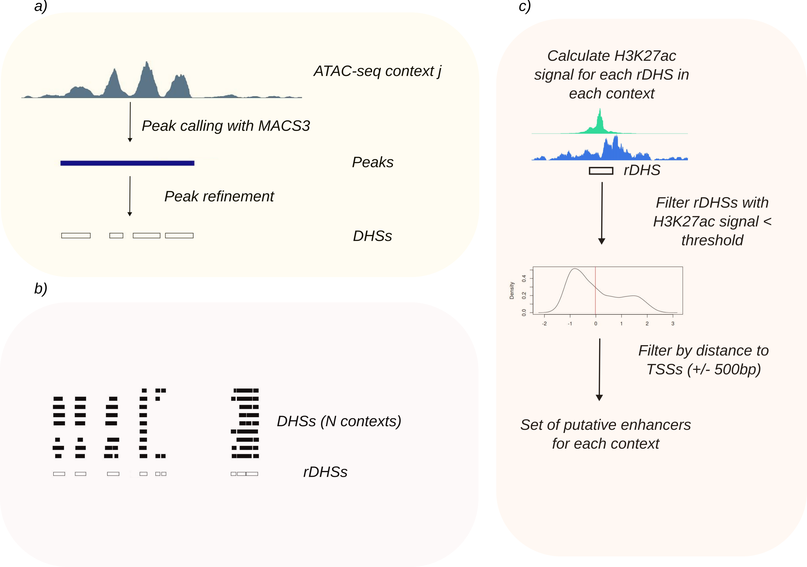

# rDHS_dm6: Pipeline for the Identification of Transcriptional Enhancers in *Drosophila melanogaster*

This repository implements the **rDHS_dm6** pipeline for the identification of **transcriptional enhancers** in *Drosophila melanogaster* using **ATAC-seq** and **H3K27ac ChIP-seq** data across nine spatio-temporal contexts.  
The workflow is an **adaptation of the ENCODE cCRE pipeline** ([weng-lab/ENCODE-cCREs](https://github.com/weng-lab/ENCODE-cCREs/tree/master/Version-4/cCRE-Pipeline)).

---

## Table of Contents
1. [Overview](#overview)
2. [Pipeline Summary](#pipeline-summary)
3. [Repository Structure](#repository-structure)
4. [Dependencies](#dependencies)
5. [How to Run the Pipeline](#how-to-run-the-pipeline)

---

# Overview

The **rDHS_dm6** pipeline integrates **ATAC-seq** and **H3K27ac** data to identify active regulatory regions in the *Drosophila melanogaster* genome.  
It defines a non-redundant set of accessible chromatin sites (*representative DNase hypersensitive sites*, rDHSs), evaluates their histone acetylation signal, and classifies them as active **candidate cis-regulatory elements (cCREs)** or **distal enhancers (dELS)**.

---

# Pipeline Summary

The workflow consists of four main stages:

1. **Refinement of ATAC-seq peaks**  
   - **Script:** `generate_rDHS.sh`  
   - Refines ATAC-seq peak regions and defines high-resolution DNase hypersensitive sites (DHSs).

2. **Generation of representative DHSs (rDHSs)**  
   - **Script:** `generate_rDHS.sh`  
   - Merges DHSs across the nine contexts into a non-redundant set of representative DHSs.

3. **Integration of H3K27ac and identification of cCREs**  
   - **Script:** `annotate_rDHSs.sh` and `generate_cCREs.R`  
   - Quantifies H3K27ac signal around each rDHS, normalizes the data, and defines active cCREs per context.

4. **Filtering of distal enhancers (dELS)**  
   - **Script:** `filter_dELS.sh`  
   - Removes promoter-proximal cCREs (within ±500 bp of transcription start sites) to obtain the final set of distal enhancers.



**Figure:** Overview of the rDHS_dm6 pipeline for defining transcriptional enhancers in *Drosophila melanogaster* from ATAC-seq and H3K27ac data.

---

# Working Directory Structure
```bash
./
├── peaks/
│ ├── ATAC_seq/ # ATAC-seq peak and signal files
│ ├── dm6.chrom.sizes # Genome size file
│ └── TSSs_dm6.bed # Reference transcription start sites
├── metadata/
│ ├── ATAC.txt
│ ├── ATAC_ids_complete_data.txt
│ ├── H3K27ac_ids.txt
│ └── ...
├── scripts/
│ ├── generate_rDHS.sh
│ ├── annotate_rDHSs.sh
│ ├── generate_cCREs.R
│ └── filter_dELS.sh
├── results/
│ ├── DHSs/
│ ├── rDHSs/
│ ├── cCREs/
│ └── dELS/
└── README.md
```

---

# Tested with

- **bedtools == 2.31.0**  
- **bedmap == 2.4.41**  
- **python == 3.12**
- **MACS3 == 3.0.3**  
- **R ≥ 4.5.2** with the package:
- **optparse**

---

# How to Run the Pipeline

All commands should be executed from the repository root directory (`rDHS_dm6/`).  
Each step corresponds to one of the main scripts described above.

### 1. Generate representative DHSs
```bash
bash generate_rDHS.sh -w ../ -l ../metadata/ATAC.txt -j 14
```
### 2. Annotate rDHSs with H3K27ac signal
```bash
bash annotate_rDHSs.sh \
  -w ../dELS_all_contexts_tests \
  -m ../metadata_files/ATAC_ids_complete_data.txt \
  -g ../dm6_genome_datafiles/dm6.chrom.sizes \
  -a ../signal_files/H3K27ac \
  -e ../metadata_files/H3K27ac_ids.txt
```
### 3. Generate candidate cis-regulatory elements (cCREs)
```bash
Rscript generate_cCREs.R \
  -l ../dELS_all_contexts_tests/dataset_left.bed \
  -r ../dELS_all_contexts_tests/dataset_right.bed \
  -c ../dELS_all_contexts_tests/dataset_central.bed \
  -a ../dELS_all_contexts_tests/reference.bed \
  -o ../dELS_all_contexts_tests/cCREs.bed \
  -p 0.6
```
### 4. Filter distal enhancers (remove promoter-proximal elements)
```bash
bash filter_dELS.sh \
  -c ../dELS_all_contexts_tests/cCREs.bed \
  -t ../dm6_genome_datafiles/dm6_TSS_RefSeqNCBI.bed \
  -g ../dm6_genome_datafiles/dm6.chrom.sizes \
  -m ../metadata_files/ATAC_ids_complete_data.txt
```
Final Output:
dELS.bed — non-redundant set of distal transcriptional enhancers across all contexts.